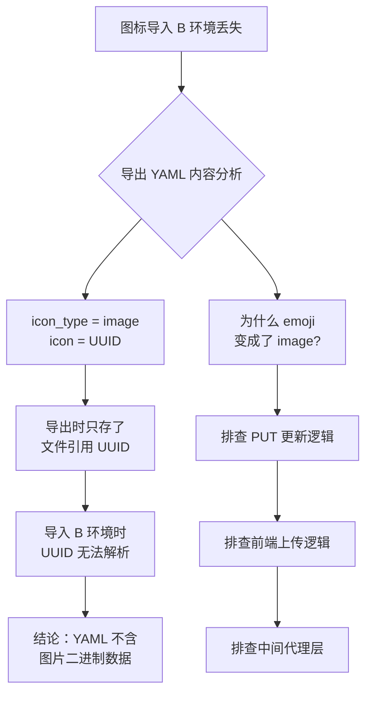
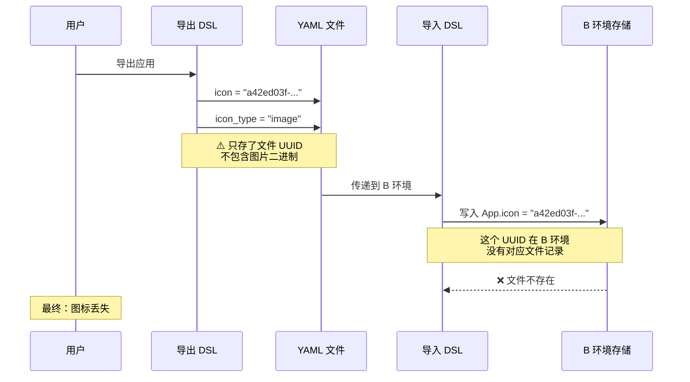

# Dify 跨环境导入导出应用图标丢失问题深度解析

> **创建时间**: 2026-07-08 17:10
> **Dify 版本**: 基于源码分析（1.13.x / main 分支）
> **问题类型**: DSL 导出格式缺陷
> **影响范围**: 所有使用自定义图片作为图标的应用跨环境迁移

---

## 一、问题背景

### 1.1 业务场景

在 Dify 平台中，用户可以给应用设置自定义图标，支持三种类型：

| 图标类型 | 存储内容 | 示例 |
|---------|---------|------|
| `emoji` | Emoji 名称字符串 | `grinning`、`heart_eyes` |
| `image` | 上传图片文件的 UUID | `a42ed03f-2ae2-48a1-8c1a-f92c8a6b7730` |
| `link` | 外部图片 URL | `https://example.com/icon.png` |

当用户需要将应用从一个 Dify 环境（如测试环境 A）导出并导入到另一个环境（如生产环境 B）时，会使用 DSL（YAML 格式）的导出/导入功能。

### 1.2 问题现象

用户反馈如下操作步骤：

1. 在 A 环境的 Dify 页面创建一个应用（工作流）
2. 给应用设置一个图标 —— **选择了一个 Emoji 表情**
3. 导出该应用为 DSL（YAML 文件）
4. 将 YAML 文件导入到 B 环境
5. 发现 B 环境中的应用 **图标丢失**，只显示默认图标

检查导出的 YAML 文件内容：

```yaml
app:
  description: ''
  icon: a42ed03f-2ae2-48a1-8c1a-f92c8a6b7730
  icon_background: ''
  icon_type: image
  mode: workflow
  name: 真实可用--安全事件查询测试剧本0622
  use_icon_as_answer_icon: false
```

**关键疑点**：
- 明明选择的是 Emoji，但 YAML 里 `icon_type` 却是 `image`
- `icon` 字段是一个 UUID，而不是 Emoji 名称
- `icon_background` 为空（与设置时的值不符）

---

## 二、问题排查过程

### 2.1 排查思路



### 2.2 第一步：分析导出逻辑

应用导出的核心代码在 [`AppDslService.export_dsl()`](file:///e:/Ideaproject/dify-work/dify/api/services/app_dsl_service.py#L513-L546) 中：

```python
@classmethod
def export_dsl(cls, app_model: App, include_secret: bool = False, workflow_id: str | None = None) -> str:
    app_mode = AppMode.value_of(app_model.mode)

    export_data = {
        "version": CURRENT_DSL_VERSION,
        "kind": "app",
        "app": {
            "name": app_model.name,
            "mode": app_model.mode.value if isinstance(app_model.mode, AppMode) else app_model.mode,
            "icon": app_model.icon,                        # ← 直接存数据库中的值
            "icon_type": (                                  # ← 直接存数据库中的值
                app_model.icon_type.value if isinstance(app_model.icon_type, IconType) else app_model.icon_type
            ),
            "icon_background": app_model.icon_background,  # ← 直接存数据库中的值
            "description": app_model.description,
            "use_icon_as_answer_icon": app_model.use_icon_as_answer_icon,
        },
    }
    # ...
```

**问题所在**：导出时直接读取数据库 `App` 表的 `icon` 字段值。如果 `icon_type` 是 `image`，那 `icon` 存的就是一个**文件记录的 UUID**，**没有任何逻辑去读取文件内容并包含到导出 YAML 中**。

### 2.3 第二步：分析导入逻辑

应用导入的核心代码在 [`AppDslService._create_or_update_app()`](file:///e:/Ideaproject/dify-work/dify/api/services/app_dsl_service.py#L378-L511) 中：

```python
def _create_or_update_app(self, *, app, data, account, ...):
    app_data = data.get("app", {})

    icon_type_value = icon_type or app_data.get("icon_type")
    if icon_type_value in [IconType.EMOJI, IconType.IMAGE, IconType.LINK]:
        resolved_icon_type = IconType(icon_type_value)
    else:
        resolved_icon_type = IconType.EMOJI
    icon = icon or str(app_data.get("icon", ""))

    # 直接写入新 App
    app.icon_type = resolved_icon_type
    app.icon = icon
    app.icon_background = icon_background or app_data.get("icon_background", "#FFFFFF")
```

**问题所在**：导入时直接把 YAML 中的 UUID `a42ed03f-2ae2-48a1-8c1a-f92c8a6b7730` 写入新环境的 `App` 表。**没有任何逻辑去创建对应的文件记录或下载图片内容**。这个 UUID 在新环境中是个死引用。

### 2.4 第三步：数据模型确认

`App` 模型定义（[`App`](file:///e:/Ideaproject/dify-work/dify/api/models/model.py#L396-L420)）：

```python
class App(Base):
    __tablename__ = "apps"

    id: Mapped[str] = mapped_column(StringUUID, ...)
    name: Mapped[str] = mapped_column(String(255))
    # ...
    icon_type: Mapped[IconType | None] = mapped_column(EnumText(IconType, length=255))
    icon = mapped_column(String(255))         # ← 只是一个字符串字段
    icon_background: Mapped[str | None] = mapped_column(String(255))
```

`icon` 只是 `String(255)`，对 `image` 类型来说，它存的就是文件 UUID。这个 UUID 指向文件存储服务（如 S3、本地磁盘等）中的实际图片文件。

`IconType` 枚举（[`IconType`](file:///e:/Ideaproject/dify-work/dify/api/models/model.py#L390-L393)）：

```python
class IconType(StrEnum):
    IMAGE = auto()   # 图片文件
    EMOJI = auto()   # Emoji 名称
    LINK = auto()    # 外部 URL
```

---

## 三、根本原因

### 3.1 核心原因图解



### 3.2 两类图标跨环境传输的对比

| 图标类型 | 导出内容 | 跨环境可用性 | 原因 |
|---------|---------|------------|------|
| `emoji` | `icon: grinning` + `icon_type: emoji` | ✅ **可用** | 纯文本字符串，不依赖文件存储 |
| `image` | `icon: <UUID>` + `icon_type: image` | ❌ **不可用** | UUID 是环境 A 的文件引用，B 环境无法解析 |
| `link` | `icon: <URL>` + `icon_type: link` | ✅ **有条件可用** | 取决于外部 URL 的跨环境可达性 |

### 3.3 Emoji 变成 Image 的可能原因

分析过程中发现一个疑点：用户明明选择的是 Emoji，但导出 YAML 却显示 `image` 类型。可能有以下原因：

**原因 1：Emoji 被前端转为图片上传**
- 前端在选择 Emoji 时，可能先将 Emoji 渲染为 Canvas/图片，再上传到文件服务
- 然后用返回的 file_id 而不是 Emoji 名字去调 PUT 接口
- 需要检查前端 `app-icon` 组件的逻辑

**原因 2：用户先后设置了两种图标**
- 先选择 Emoji → 保存（此时数据库 `icon_type = emoji`）
- 后又上传了本地图片 → 保存（此时数据库 `icon_type = image`）
- 最终导出的 YAML 是后一次操作的状态

**原因 3：中间代理层的处理**
- 请求通过 `/soar/proxy/` 代理中转
- 代理层可能对请求体做了额外处理

> **注意**：以上三个原因需要结合实际环境进一步确认。无论哪种原因，核心问题依然是 —— **DSL 导出格式不支持携带图片文件数据**。

---

## 四、DSL 版本对比

### 4.1 当前 DSL 版本（0.6.0）

当前导出版本为 `0.6.0`，其 `app` 段支持的字段：

```yaml
app:
  name: string
  mode: string
  icon: string          # emoji 名字 / 文件 UUID / URL
  icon_type: string     # emoji / image / link
  icon_background: string
  description: string
  use_icon_as_answer_icon: boolean
```

**局限性**：
- 不支持图片文件数据的嵌入
- 不支持引用外部资源（文件、数据集等）的自包含
- 跨环境导入时，所有文件类型的引用都会断裂

### 4.2 理想 DSL 版本

对于完全自包含的导出格式，应该支持：

```yaml
app:
  icon: a42ed03f-...
  icon_type: image
  icon_data:              # ← 新增：嵌入的图片数据
    mime_type: image/png
    base64: iVBORw0KGgo...
  icon_background: '#FBE8FF'
```

这样导入时就能通过 `icon_data` 重建文件记录。

---

## 五、影响因素与延伸分析

### 5.1 App 表与 Site 表的图标同步问题

之前的分析还发现另一个相关但独立的问题：**`PUT /console/api/apps/{id}` 更新 App 表图标时，不会同步更新 Site 表**。

```python
# services/app_service.py - update_app 方法
def update_app(self, app: App, args: ArgsDict) -> App:
    # 更新 App 表
    app.icon = args["icon"]
    # ...
    db.session.commit()

    # ⚠️ 没有同步更新 Site 表！
    # Site 表也有 icon_type / icon / icon_background
```

运行界面（WebApp）的图标从 `Site` 表读取，控制台列表从 `App` 表读取。这两个地方如果不同步，就会出现：

- **控制台列表**：图标已更新 ✅
- **运行界面（WebApp）**：图标还是旧的 ❌

**不过，这个问题与"导入导出图标丢失"是独立的**，不要混淆。

### 5.2 影响范围评估

| 场景 | 是否受影响 | 说明 |
|------|-----------|------|
| 同一环境内操作 | 不受影响 | App 表和文件存储在同一数据库/存储 |
| emoji 图标跨环境导入导出 | ✅ 基本不受影响 | 纯字符串，跨环境一致 |
| image 图标跨环境导入导出 | ❌ **严重受影响** | 文件 UUID 在新环境无效 |
| link 图标跨环境导入导出 | ⚠️ 有条件受影响 | 取决于 URL 的可达性 |
| 包含数据集引用的 DSL 导出 | ❌ 同样受影响 | dataset_ids 也使用加密 UUID，跨环境不可用 |

---

## 六、解决方案

### 6.1 方案对比

| 方案 | 复杂度 | 完整性 | 推荐度 | 说明 |
|------|--------|--------|--------|------|
| 方案 A：导出时嵌入 base64 图片 | 中 | 高 | ⭐⭐⭐⭐⭐ | 最彻底的解决方案 |
| 方案 B：导出时降级为 emoji | 低 | 低 | ⭐⭐⭐ | 简单但不保留原图 |
| 方案 C：手动跨环境迁移文件 | 高 | 中 | ⭐⭐ | 运维成本高 |
| 方案 D：使用 link 类型替代 image | 低 | 低 | ⭐ | 依赖外部 URL 可用性 |

### 6.2 方案 A（推荐）：导出时嵌入 base64 图片

**核心思路**：导出时，如果 `icon_type` 是 `image`，读取文件的二进制内容，转为 base64 嵌入 YAML。导入时，如果检测到 `icon_data`，则重建文件记录并用新的 UUID 写入 `App.icon`。

#### 导出端修改

在 [`export_dsl()`](file:///e:/Ideaproject/dify-work/dify/api/services/app_dsl_service.py#L513-L546) 中增加图片读取逻辑：

```python
@classmethod
def export_dsl(cls, app_model: App, include_secret: bool = False, workflow_id: str | None = None) -> str:
    export_data = {
        "version": CURRENT_DSL_VERSION,
        "kind": "app",
        "app": {
            # ... 原有字段
        },
    }

    # ===== 新增：图片类型的图标，嵌入 base64 =====
    app_section = export_data["app"]
    if app_section.get("icon_type") == "image" and app_section.get("icon"):
        file_uuid = app_section["icon"]
        try:
            # 从文件存储读取二进制内容
            from extensions.ext_storage import storage
            file_bytes = storage.load(file_uuid)
            import base64
            app_section["icon_data"] = base64.b64encode(file_bytes).decode("utf-8")
            # 可选：记录 MIME 类型
            from models.model import File
            file_record = db.session.get(File, file_uuid)
            if file_record:
                app_section["icon_mime_type"] = file_record.mime_type or "image/png"
        except Exception:
            # 文件不存在或读取失败，保持原样
            pass
    # ============================================
```

#### 导入端修改

在 [`_create_or_update_app()`](file:///e:/Ideaproject/dify-work/dify/api/services/app_dsl_service.py#L378-L511) 中增加图片重建逻辑：

```python
# ===== 新增：从 icon_data 重建图片文件 =====
icon_data = app_data.get("icon_data")
if icon_type_value == "image" and icon_data:
    import base64
    try:
        file_bytes = base64.b64decode(icon_data)
        mime_type = app_data.get("icon_mime_type", "image/png")
        from extensions.ext_storage import storage
        from models.model import File
        # 创建文件记录
        new_file_uuid = str(uuid.uuid4())
        storage.save(new_file_uuid, file_bytes)
        # 可选：写入 File 表记录
        # file_record = File(id=new_file_uuid, name="app_icon", mime_type=mime_type, ...)
        # session.add(file_record)
        icon = new_file_uuid  # 用新 UUID 替换
    except Exception:
        # 重建失败，使用默认图标
        icon = ""
        resolved_icon_type = IconType.EMOJI  # 降级为 emoji
# ==========================================
```

#### 导出的 YAML 格式

```yaml
app:
  description: ''
  icon: a42ed03f-2ae2-48a1-8c1a-f92c8a6b7730
  icon_background: '#FBE8FF'
  icon_data: iVBORw0KGgoAAAANSUhEUgAA...   # ← base64 编码的图片数据
  icon_mime_type: image/png                    # ← MIME 类型
  icon_type: image
  mode: workflow
  name: 我的应用
```

### 6.3 方案 B（简易方案）：导出时降级为 emoji

如果短时间内无法修改 DSL 格式，可以做一个简易的降级处理：

**导出端**：当 `icon_type == "image"` 时，改用默认 emoji 替代：

```python
# 简单降级处理
if app_section.get("icon_type") == "image":
    app_section["icon"] = "rocket"        # 默认图标
    app_section["icon_type"] = "emoji"    # 降级为 emoji
    app_section["icon_background"] = "#FBE8FF"
```

**缺点**：不保留原图，只是给用户一个"还能看"的兜底。

### 6.4 方案 C：手动文件迁移（运维方案）

如果代码改不动，可以配合运维手段：

1. **导出 YAML**：正常从 A 环境导出
2. **导出文件**：从 A 环境的文件存储（S3/MinIO/本地磁盘）找到 `a42ed03f-...` 文件
3. **上传文件**：将文件上传到 B 环境的文件存储，保持相同 UUID（如果可以）
4. **导入 YAML**：正常导入 B 环境

如果无法保持 UUID 一致，需要修改导入后的数据库记录。

---

## 七、总结

### 7.1 问题回顾

| 问题 | 答案 |
|------|------|
| 为什么 image 图标跨环境会丢失？ | DSL 导出格式只存文件 UUID，不包含图片二进制数据 |
| 为什么 emoji 图标也可能出问题？ | 前端或代理层可能将 emoji 转成了 image 再保存 |
| 所有图标类型都会受影响吗？ | 只有 `image` 类型受影响，`emoji` 和 `link` 不受影响 |
| 如何彻底解决？ | 在 DSL 格式中增加 `icon_data`（base64）字段，导入时重建文件 |

### 7.2 一句话总结

> **Dify 当前的 DSL 导出格式（v0.6.0）不支持携带图片文件数据，`image` 类型的图标在跨环境导入时会因为文件 UUID 不存在而导致图标丢失。**

### 7.3 后续建议

1. **短期**：导出时对 `image` 类型图标做降级处理（方案 B），保证跨环境至少不显示空白
2. **中期**：在 DSL 格式中增加 base64 图片数据支持（方案 A），实现真正自包含的导出
3. **长期**：审查 DSL 格式中所有文件/UUID 类型的引用（如 dataset_ids、tool 图标等），统一实现资源自包含导出机制

---

## 附录：相关代码文件索引

| 文件路径 | 作用 | 关键行号 |
|---------|------|----------|
| `api/services/app_dsl_service.py` | DSL 导入导出核心逻辑 | export: 513, import: 378 |
| `api/services/app_service.py` | 应用更新服务 | update_app: 376 |
| `api/models/model.py` | 数据模型 | App: 396, IconType: 390 |
| `api/controllers/console/app/app.py` | 控制台 API | PUT: 606 |
| `api/controllers/console/app/app_import.py` | 导入 API | import: 54 |
| `api/libs/helper.py` | 图标 URL 生成 | build_icon_url: 145 |

---

*本文档基于 Dify 源码分析编写，适用于理解 DSL 导入导出机制的图标处理问题。*
