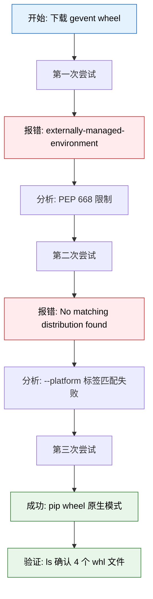

# x86 环境下载 gevent Wheel 包排错实录：从 PEP 668 到平台标签误判的完整排查

## 背景：为什么我们需要手动下载 gevent

在部署 Dify 插件及相关 Python 服务时，`gevent` 是一个高频出现的底层依赖。由于生产环境往往处于内网或受限网络中，我们无法直接在目标机器上执行 `pip install`，必须提前在构建机上下载好完整的 Wheel 包（含所有依赖），再离线安装。

然而，这个看似简单的"下载"动作，在实际操作中却接连踩坑。本文以 **x86_64 + Python 3.12 + gevent==25.5.1** 为目标，完整记录从报错到成功的排查全过程，包括每一次尝试的命令、完整输出、分析思路和修复方案。

---

## 排查流程总览



---

## 第一次尝试：PEP 668 报错

### 操作思路

我们最初的想法是：用 `uv run` 创建一个干净的 Python 3.12 临时环境，先升级 pip 到最新版以确保兼容性，再用 `pip download` 指定平台下载 wheel。

### 执行命令

```bash
mkdir -p ./tmp/wheels/

uv run --python 3.12 --with pip -- \
  pip install --upgrade pip && \
  pip download gevent==25.5.1 \
    --platform linux-x86_64 \
    --only-binary=:all: \
    -d ./tmp/wheels/
```

### 完整报错输出

```text
error: externally-managed-environment

× This environment is externally managed
╰─> This Python installation is managed by uv and should not be modified.

note: If you believe this is a mistake, please contact your Python installation
      or OS distribution provider. You can override this, at your own risk, by
      passing --break-system-packages.
hint: See PEP 668 for the detailed specification.
```

### 问题分析

`uv run` 创建的临时环境遵循 **PEP 668** 规范，被标记为"外部管理"环境，禁止在运行时通过 `pip install --upgrade pip` 修改自身。我们的命令链中第一步就触发了这个保护机制，后续的 `pip download` 根本没有机会执行。

**关键认知**：`uv` 本身支持通过 `--with` 参数直接注入指定版本的依赖，根本不需要在临时环境中手动升级 pip。我们应该让 `uv` 在创建环境时就带入新版 pip，而不是创建后再修改。

### 修复方案

-   将 `--with pip` 改为 `--with 'pip>=25.0'`，让 `uv` 在创建环境时直接带入新版 pip
-   删除 `pip install --upgrade pip &&` 这一步
-   保留 `pip download` 部分不变，进入第二次尝试

---

## 第二次尝试：No matching distribution found

### 操作思路

修复了 PEP 668 问题后，我们认为只要 pip 版本够新，`pip download --platform --only-binary` 就能正确下载到预编译 wheel。

### 执行命令

```bash
uv run --python 3.12 --with 'pip>=25.0' -- \
  pip download gevent==25.5.1 \
    --platform linux-x86_64 \
    --only-binary=:all: \
    -d ./tmp/wheels/
```

### 完整报错输出

```text
ERROR: Could not find a version that satisfies the requirement gevent==25.5.1 (from versions: none)
ERROR: No matching distribution found for gevent==25.5.1
```

### 问题分析

这是本次排查中**最具迷惑性**的一步。当前机器就是 x86_64 架构，PyPI 上也确实存在对应的 wheel（这一点在第三次尝试中得到证实），但 pip 却报告找不到任何匹配版本。

深入分析 `--platform` 和 `--only-binary=:all:` 的组合行为：

| 参数 | 作用 | 副作用 |
| :--- | :--- | :--- |
| `--platform linux-x86_64` | 告诉 pip 按指定平台查找包 | 强制进入纯下载模式，禁止源码编译 |
| `--only-binary=:all:` | 只接受预编译 wheel | 与 `--platform` 配合时，要求精确匹配平台标签 |

当这两个参数同时使用时，pip 会根据传入的平台字符串去 PyPI 索引中做**精确标签匹配**。如果 pip 对 `manylinux_2_17`、`manylinux2014` 等复合标签的识别逻辑与传入的简单 `linux-x86_64` 字符串不完全对齐，就会误判为"无可用版本"。

**核心误区**：在原生架构环境下，不应该使用 `--platform` 参数。该参数专为跨平台下载设计（例如在 ARM 机器上下载 x86 包），在原生环境中反而会引入不必要的标签匹配限制，把本来能找到的包挡在外面。

### 修复方案

-   将 `pip download` 替换为 `pip wheel`：前者只做下载，后者会自动解析依赖并生成 wheel
-   **去掉** `--platform linux-x86_64`：让 pip 自动识别当前原生架构
-   **去掉** `--only-binary=:all:`：允许 pip 优先使用预编译 wheel，必要时回退源码编译
-   将 `-d` 替换为 `--wheel-dir`：`pip wheel` 的输出目录参数名不同

---

## 第三次尝试：成功获取

### 操作思路

放弃跨平台参数，信任 pip 在当前原生 x86_64 环境中的自主决策能力。

### 执行命令

```bash
uv run --python 3.12 --with 'pip>=25.0' -- \
  pip wheel gevent==25.5.1 \
    --wheel-dir ./tmp/wheels/
```

### 完整成功输出

```text
Collecting gevent==25.5.1
  Using cached gevent-25.5.1-cp312-cp312-manylinux_2_17_x86_64.manylinux2014_x86_64.whl.metadata (13 kB)
Collecting greenlet>=3.2.2 (from gevent==25.5.1)
  Downloading greenlet-3.5.3-cp312-cp312-manylinux_2_24_x86_64.manylinux_2_28_x86_64.whl.metadata (3.8 kB)
Collecting zope.event (from gevent==25.5.1)
  Using cached zope_event-6.2-py3-none-any.whl.metadata (5.4 kB)
Collecting zope.interface (from gevent==25.5.1)
  Using cached zope_interface-8.5-cp312-cp312-manylinux1_x86_64.manylinux2014_x86_64.manylinux_2_17_x86_64.manylinux_2_5_x86_64.whl.metadata (47 kB)
Using cached gevent-25.5.1-cp312-cp312-manylinux_2_17_x86_64.manylinux2014_x86_64.whl (2.1 MB)
Downloading greenlet-3.5.3-cp312-cp312-manylinux_2_24_x86_64.manylinux_2_28_x86_64.whl (614 kB)
   ━━━━━━━━━━━━━━━━━━━━━━━━━━━━━━━━━━━━━━━━ 614.2/614.2 kB 96.3 kB/s  0:00:03
Using cached zope_event-6.2-py3-none-any.whl (6.5 kB)
Using cached zope_interface-8.5-cp312-cp312-manylinux1_x86_64.manylinux2014_x86_64.manylinux_2_17_x86_64.manylinux_2_5_x86_64.whl (270 kB)
Saved ./tmp/wheels/gevent-25.5.1-cp312-cp312-manylinux_2_17_x86_64.manylinux2014_x86_64.whl
Saved ./tmp/wheels/greenlet-3.5.3-cp312-cp312-manylinux_2_24_x86_64.manylinux_2_28_x86_64.whl
Saved ./tmp/wheels/zope_event-6.2-py3-none-any.whl
Saved ./tmp/wheels/zope_interface-8.5-cp312-cp312-manylinux1_x86_64.manylinux2014_x86_64.manylinux_2_5_x86_64.whl
```

### 关键日志解读

注意输出中的这一行：

```text
Using cached gevent-25.5.1-cp312-cp312-manylinux_2_17_x86_64.manylinux2014_x86_64.whl
```

这证明 PyPI 上**确实存在**该预编译 wheel，且 pip 在本地缓存中已经找到了它。第二次尝试的失败纯粹是 `--platform linux-x86_64` 参数导致的标签匹配问题，而非包本身缺失。去掉该参数后，pip 正确识别了 `manylinux_2_17` 和 `manylinux2014` 复合标签，直接命中缓存，甚至没有触发网络下载。

同时可以看到 `pip wheel` 自动解析并下载了全部三个依赖：`greenlet`、`zope.event`、`zope.interface`，无需手动指定。

---

## 验证：确认产物完整性

### 执行命令

```bash
ls -l ./tmp/wheels/
```

### 完整输出

```text
总用量 2900
-rw-r--r-- 1 root root 2070583  7月  8 18:32 gevent-25.5.1-cp312-cp312-manylinux_2_17_x86_64.manylinux2014_x86_64.whl
-rw-r--r-- 1 root root  614244  7月  8 18:32 greenlet-3.5.3-cp312-cp312-manylinux_2_24_x86_64.manylinux_2_28_x86_64.whl
-rw-r--r-- 1 root root    6525  7月  8 18:32 zope_event-6.2-py3-none-any.whl
-rw-r--r-- 1 root root  270689  7月  8 18:32 zope_interface-8.5-cp312-cp312-manylinux1_x86_64.manylinux2014_x86_64.manylinux_2_17_x86_64.manylinux_2_5_x86_64.whl
```

四个文件齐全，大小正常，包含 `gevent` 本体及其全部三个依赖，可直接用于离线安装。

---

## 三次尝试对比总结

| 轮次 | 核心命令 | 错误现象 | 根因 | 修复方式 |
| :--- | :--- | :--- | :--- | :--- |
| 第一次 | `pip install --upgrade pip` 在 uv 临时环境中 | externally-managed-environment | PEP 668 禁止修改受管环境 | 用 `--with 'pip>=25.0'` 注入新版 pip |
| 第二次 | `pip download --platform --only-binary` | No matching distribution found | 纯下载模式下平台标签匹配失败 | 改用 `pip wheel` 并去掉跨平台参数 |
| 第三次 | `pip wheel` 原生模式 | 成功 | pip 正确识别 manylinux 标签并命中缓存 | — |

---

## 经验沉淀

1.  **原生架构不要用 `--platform`**：`--platform` 是跨平台专用参数，在同架构环境下使用会强制 pip 进入受限的纯下载模式，反而增加失败概率。只有在"当前机器架构与目标架构不同"时才需要使用它。
2.  **`pip wheel` 优于 `pip download`**：`pip wheel` 会自动解析依赖、优先使用预编译 wheel、必要时回退源码编译，是构建离线包的首选命令。`pip download` 更适合纯下载场景，但对参数组合更敏感。
3.  **尊重 PEP 668**：不要在 `uv run` 的临时环境中尝试修改 pip 自身，通过 `--with` 参数声明依赖版本才是正解。
4.  **关注 `Using cached` 日志**：当看到这一行时，说明预编译 wheel 确实存在，之前的失败是工具链配置问题而非包缺失，应优先调整命令参数而非怀疑上游仓库。
5.  **报错信息要读完整**：第二次的 `from versions: none` 明确提示"不是版本不存在，而是当前筛选条件下没有匹配项"，这应该引导我们去检查筛选条件（即 `--platform` 参数），而不是换版本号重试。

### 离线安装验证命令

将 `./tmp/wheels/` 拷贝至目标机器后，执行：

```bash
pip install --no-index --find-links=./tmp/wheels/ gevent==25.5.1
```

至此，x86_64 环境下 `gevent==25.5.1` 的 Wheel 包下载问题圆满解决。