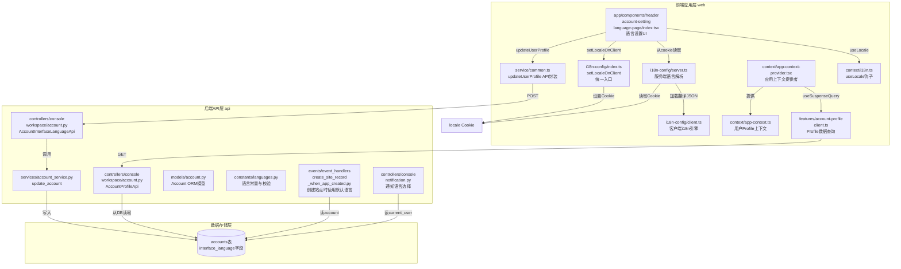
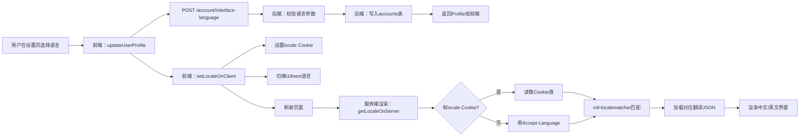
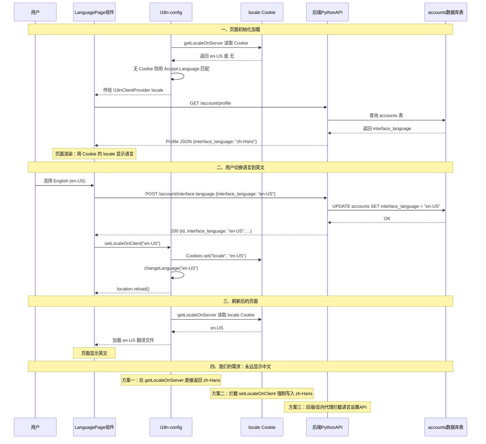
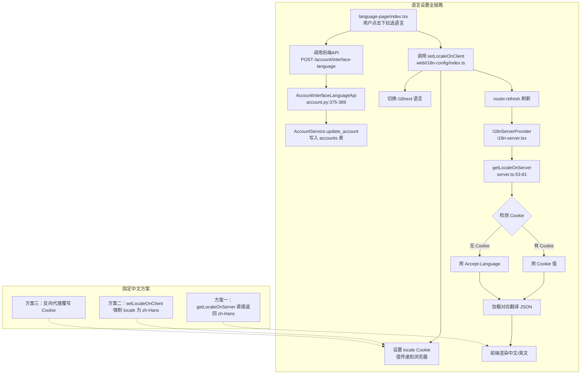

# Dify 语言设置机制源码级分析：从接口到前端的完整链路与固定中文实战

## 一、背景

我们在基于 Dify 开源版做二次开发，将 Dify 的前端页面嵌入到自己的平台中，接口仍然指向原始的 Dify 后端服务。

出现问题：有人在原始 Dify 服务的"个人设置"中将界面语言切换为英文（en-US），导致我们的嵌入页面也全部显示为英文。

我们尝试调用 `POST /console/api/account/interface-language` 传 `{"interface_language":"zh-Hans"}` 改回来，但只要对方再次切换，语言又会变回去。

因此我们需要深入理解 Dify 语言机制的完整链路，找到一劳永逸的"固定中文"方案。

---

## 二、项目目录架构概览

Dify 项目是一个前后端分离的架构，前端为 Next.js 应用，后端为 Python Flask 应用。以下是与语言设置功能强相关的模块结构：



---

## 三、语言设置核心流程总览



---

## 四、后端存储层：Account 模型

### 4.1 ORM 模型定义

**文件**: `api/models/account.py`

```python
class Account(UserMixin, TypeBase):
    __tablename__ = "accounts"

    id: Mapped[str] = mapped_column(
        StringUUID, insert_default=lambda: str(uuid4()), default_factory=lambda: str(uuid4()), init=False
    )
    name: Mapped[str] = mapped_column(String(255))
    email: Mapped[str] = mapped_column(String(255))
    password: Mapped[str | None] = mapped_column(String(255), default=None)
    password_salt: Mapped[str | None] = mapped_column(String(255), default=None)
    avatar: Mapped[str | None] = mapped_column(String(255), nullable=True, default=None)
    # ====== 核心字段：界面语言 ======
    interface_language: Mapped[str | None] = mapped_column(String(255), default=None)
    # ===============================
    interface_theme: Mapped[str | None] = mapped_column(String(255), nullable=True, default=None)
    timezone: Mapped[str | None] = mapped_column(String(255), default=None)
    last_login_at: Mapped[datetime | None] = mapped_column(DateTime, nullable=True, default=None)
    ...
```

`interface_language` 是一个可为空的字符串列，默认值为 `None`。当用户首次创建账号未设置时，该字段为 NULL。

### 4.2 语言常量与校验

**文件**: `api/constants/languages.py`

```python
language_timezone_mapping = {
    "en-US": "America/New_York",
    "zh-Hans": "Asia/Shanghai",
    "zh-Hant": "Asia/Taipei",
    "pt-BR": "America/Sao_Paulo",
    "es-ES": "Europe/Madrid",
    "fr-FR": "Europe/Paris",
    "de-DE": "Europe/Berlin",
    "ja-JP": "Asia/Tokyo",
    "ko-KR": "Asia/Seoul",
    ...
}

languages = list(language_timezone_mapping.keys())

def supported_language(lang):
    """校验语言值是否合法，枚举值只能从 language_timezone_mapping 的 key 中取"""
    if lang in languages:
        return lang
    error = f"{lang} is not a valid language."
    raise ValueError(error)

def get_valid_language(lang: str | None) -> str:
    """获取有效语言，如果为空或不合法则返回第一个（en-US）"""
    if lang and lang in languages:
        return lang
    return languages[0]
```

这里定义了 Dify 支持的全部 22 种语言。`supported_language()` 是一个严格的校验函数，会在 API 层被调用，确保只有这些枚举值才能写入数据库。

---

## 五、后端 API 层

### 5.1 语言设置 API

**文件**: `api/controllers/console/workspace/account.py`

```python
class AccountInterfaceLanguagePayload(BaseModel):
    """接口语言请求体的 Pydantic 模型"""
    interface_language: str

    @field_validator("interface_language")
    @classmethod
    def validate_language(cls, value: str) -> str:
        # 通过 supported_language 检查枚举合法性
        return supported_language(value)


@console_ns.route("/account/interface-language")
class AccountInterfaceLanguageApi(Resource):
    @console_ns.expect(console_ns.models[AccountInterfaceLanguagePayload.__name__])
    @setup_required          # 确保系统已完成初始化安装
    @login_required           # 需要登录
    @account_initialization_required  # 账户初始化后才可访问
    def post(self):
        # 获取当前登录用户
        current_user, _ = current_account_with_tenant()
        payload = console_ns.payload or {}
        # 校验请求体
        args = AccountInterfaceLanguagePayload.model_validate(payload)

        # 核心：更新账户的语言字段
        updated_account = AccountService.update_account(
            current_user, interface_language=args.interface_language
        )

        # 序列化后返回更新后的用户信息
        return _serialize_account(updated_account)
```

关键设计点：
- 这是一个 `POST` 请求而不是 `PUT`/`PATCH`，因为它同时做了"校验"和"修改"两件事
- 返回完整的 `AccountResponse`，让前端可以更新本地缓存的用户信息
- 装饰器 `@login_required` 保证只有已登录用户才能修改

### 5.2 AccountService 更新方法

**文件**: `api/services/account_service.py`

```python
@staticmethod
def update_account(account, **kwargs):
    """通用字段更新方法，通过 kwargs 动态更新任意合法字段"""
    account = db.session.merge(account)  # 把离线对象重新attach到session
    for field, value in kwargs.items():
        if hasattr(account, field):      # 安全检查：字段必须存在于模型中
            setattr(account, field, value)
        else:
            raise AttributeError(f"Invalid field: {field}")
    db.session.commit()                  # 提交事务，写入数据库
    return account
```

`update_account` 是一个通用的更新方法，不仅仅给语言使用。`**kwargs` 让它可以接收任意模型字段，包括 `name`、`avatar`、`interface_language`、`timezone` 等。

### 5.3 Profile 查询 API

**文件**: `api/controllers/console/workspace/account.py`

```python
@console_ns.route("/account/profile")
class AccountProfileApi(Resource):
    @setup_required
    @login_required
    @account_initialization_required
    @enterprise_license_required
    def get(self):
        current_user, _ = current_account_with_tenant()
        # 直接从数据库读取当前用户信息并序列化返回
        return _serialize_account(current_user)


def _serialize_account(account) -> dict[str, Any]:
    """将 Account ORM 对象序列化为 JSON 响应"""
    return AccountResponse.model_validate(account, from_attributes=True).model_dump(mode="json")
```

### 5.4 AccountResponse 序列化模型

**文件**: `api/fields/member_fields.py`

```python
class Account(_AccountAvatar):
    """用户信息的响应模型，对应 /account/profile 的返回结构"""
    id: str
    name: str
    email: str
    is_password_set: bool
    interface_language: str | None = None   # 语言字段，可为空
    interface_theme: str | None = None
    timezone: str | None = None
    last_login_at: int | None = None
    last_login_ip: str | None = None
    created_at: int | None = None
```

---

## 六、前端 Profile 获取与缓存

### 6.1 Profile 数据查询

**文件**: `web/features/account-profile/client.ts`

```typescript
import { queryOptions } from '@tanstack/react-query'

export const userProfileQueryOptions = () =>
  queryOptions<UserProfileWithMeta>({
    queryKey: ['console', 'account', 'profile', 'get'],
    queryFn: async () => {
      const response = await get<Response>('/account/profile', {}, {
        needAllResponseContent: true,
        silent: true,
      })
      const profile: GetAccountProfileResponse = await response.clone().json()
      return {
        profile,
        meta: {
          currentVersion: response.headers.get('x-version'),
          currentEnv: IS_DEV ? 'DEVELOPMENT' : response.headers.get('x-env'),
        },
      }
    },
    retry: (failureCount, error) => !isLegacyBase401(error) && failureCount < 3,
  })
```

### 6.2 从 AppContextProvider 暴露给全局

**文件**: `web/context/app-context-provider.tsx`

```typescript
// 在应用根组件中使用 useSuspenseQuery 获取用户信息
const { data: userProfileResp } = useSuspenseQuery(userProfileQueryOptions())

// 通过 React Context 共享给全局
const userProfile = useMemo<GetAccountProfileResponse>(
  () => userProfileResp?.profile || userProfilePlaceholder,
  [userProfileResp?.profile],
)

const mutateUserProfile = useCallback(() => {
  queryClient.invalidateQueries({ queryKey: userProfileQueryOptions().queryKey })
}, [queryClient])
```

---

## 七、前端语言解析层（核心）

这是理解"固定中文"方案最关键的部分。

### 7.1 服务端语言检测

**文件**: `web/i18n-config/server.ts`

```typescript
export const getLocaleOnServer = async (): Promise<Locale> => {
  const cached = getLocaleCache()
  if (cached)
    return cached  // 请求级别缓存

  const locales: string[] = i18n.locales  // 支持的语言列表

  let languages: string[] | undefined
  // ========== 第一步：优先从 Cookie 读取 ==========
  const localeCookie = (await cookies()).get('locale')
  languages = localeCookie?.value ? [localeCookie.value] : []

  // ========== 第二步：没有 Cookie 则从 Accept-Language 请求头读取 ==========
  if (!languages.length) {
    const negotiatorHeaders: Record<string, string> = {}
    ;(await headers()).forEach((value, key) => (negotiatorHeaders[key] = value))
    languages = new Negotiator({ headers: negotiatorHeaders }).languages()
  }

  // 校验
  if (!Array.isArray(languages) || languages.length === 0
      || !languages.every(lang => typeof lang === 'string' && /^[\w-]+$/.test(lang)))
    languages = [i18n.defaultLocale]  // 回退到 'en-US'

  // ========== 第三步：通过 intl-localematcher 进行最佳匹配 ==========
  const matchedLocale = match(languages, locales, i18n.defaultLocale) as Locale
  setLocaleCache(matchedLocale)
  return matchedLocale
}
```

**关键设计思想**：
1. **Cookie 优先**：语言设置的修改通过 `setLocaleOnClient` 写入 `locale` Cookie，服务端渲染时优先读取
2. **Accept-Language 兜底**：没有 Cookie 时，用浏览器语言协商
3. **intl-localematcher 匹配**：用标准库将浏览器语言（如 `zh-CN,zh;q=0.9`）匹配到 Dify 支持的语言（`zh-Hans`）

### 7.2 客户端设置语言

**文件**: `web/i18n-config/index.ts`

```typescript
export const setLocaleOnClient = async (locale: Locale, reloadPage = true) => {
  // ===== 第1步：设置 locale Cookie，有效期365天 =====
  Cookies.set(LOCALE_COOKIE_NAME, locale, { expires: 365 })

  // ===== 第2步：切换 i18next 引擎语言 =====
  await changeLanguage(locale)

  // ===== 第3步：刷新页面，触发服务端重新渲染 =====
  if (reloadPage)
    location.reload()
}
```

**LOCALE_COOKIE_NAME** 定义在 `web/config/index.ts`：

```typescript
export const LOCALE_COOKIE_NAME = 'locale'
```

### 7.3 客户端 i18n 引擎

**文件**: `web/i18n-config/client.ts`

```typescript
export const changeLanguage = async (lng?: Locale) => {
  if (!lng)
    return
  const i18n = getI18n()          // 获取当前 i18next 实例
  await i18n.changeLanguage(lng)   // 异步切换语言
}

export function createI18nextInstance(lng: Locale, resources: Resource) {
  const instance = createInstance()
  instance
    .use(initReactI18next)
    .use(resourcesToBackend((
      language: Locale,
      namespace: NamespaceInFileName | Namespace,
    ) => {
      // 动态加载翻译 JSON，路径为 web/i18n/{language}/{namespace}.json
      const namespaceKebab = kebabCase(namespace)
      return import(`../i18n/${language}/${namespaceKebab}.json`)
    }))
    .init({
      ...getInitOptions(),
      lng,
      resources,
    })
  return instance
}
```

**i18next 配置**（`web/i18n-config/settings.ts`）：

```typescript
export function getInitOptions(): InitOptions {
  return {
    load: 'currentOnly',        // 只加载当前语言的翻译
    fallbackLng: 'en-US',       // 找不到翻译时的回退语言
    partialBundledLanguages: true,
    keySeparator: false,
    ns: namespaces,             // 命名空间列表
    interpolation: {
      escapeValue: false,
    },
  }
}
```

### 7.4 服务端 Provider 注入

**文件**: `web/app/components/provider/i18n-server.tsx`

```typescript
export async function I18nServerProvider({ children }: { children: React.ReactNode }) {
  // 服务端获取 locale（读 Cookie 或 Accept-Language）
  const locale = await getLocaleOnServer()

  // 加载对应语言的翻译 JSON 文件
  const resource = await getResources(locale)

  // 传给客户端 Provider
  return (
    <I18nClientProvider locale={locale} resource={resource}>
      {children}
    </I18nClientProvider>
  )
}
```

**文件**: `web/app/components/provider/i18n.tsx`

```typescript
export function I18nClientProvider({
  locale, resource, children,
}: { locale: Locale, resource: Resource, children: React.ReactNode }) {
  // 用服务端获取的 locale 和翻译资源创建 i18next 实例
  const i18n = createI18nextInstance(locale, resource)

  return (
    <I18nextProvider i18n={i18n}>
      {children}
    </I18nextProvider>
  )
}
```

### 7.5 前端 useLocale 钩子

**文件**: `web/context/i18n.ts`

```typescript
export const useLocale = () => {
  const { i18n } = useTranslation()
  return i18n.language as Locale  // 返回当前 i18next 使用的语言
}
```

语言设置页面用这个钩子来显示当前选中的语言。

---

## 八、语言设置界面组件

### 8.1 LanguagePage 组件

**文件**: `web/app/components/header/account-setting/language-page/index.tsx`

```typescript
export default function LanguagePage() {
  // 从 i18next 获取当前语言
  const locale = useLocale()
  // 从 AppContext 获取用户 Profile（含 interface_language）
  const { userProfile, mutateUserProfile } = useAppContext()

  // ... 下拉选择语言时的处理逻辑
  const handleSelectLanguage = async (item: SelectOption) => {
    const url = '/account/interface-language'
    const bodyKey = 'interface_language'
    setEditing(true)
    try {
      // ===== 第1步：调后端API，更新数据库中的 interface_language =====
      await updateUserProfile({ url, body: { [bodyKey]: item.value } })

      // ===== 第2步：设置 Cookie 并切换 i18next 语言 =====
      setLocaleOnClient(item.value.toString() as Locale, false)
      //  参数 false 表示不刷新页面，用 router.refresh() 代替

      // ===== 第3步：触发服务端重新渲染 =====
      router.refresh()
    } catch (e) {
      toast.error((e as Error).message)
    }
  }

  // ...
  // 当前选中的语言由 locale（Cookie决定）或 userProfile.interface_language（API决定）共同确定
  const selectedLanguage = languageOptions.find(
    item => item.value === (locale || userProfile.interface_language)
  )
  // ...
}
```

**关键设计思想**：
- `locale`（来自 Cookie）优先于 `userProfile.interface_language`（来自 API）作为显示依据
- 选择语言时做两件事：更新后端 & 设置 Cookie，两者缺一不可
- 如果只更新后端而不设置 Cookie，刷新后前端会读取旧的 Cookie 值，仍然显示旧语言

### 8.2 updateUserProfile 工具函数

**文件**: `web/service/common.ts`

```typescript
export const updateUserProfile = ({
  url, body,
}: { url: string, body: Record<string, any> }): Promise<CommonResponse> => {
  return post<CommonResponse>(url, { body })
}
```

这是一个通用的 POST 封装，通过传入不同的 URL 和 body 来调用后端的不同接口。

---

## 九、后端语言字段的受众场景（interface_language 在何处真正生效）

后端读取 `interface_language` 的场景极其有限：

### 场景1：创建应用时设置站点默认语言

**文件**: `api/events/event_handlers/create_site_record_when_app_created.py`

```python
@app_was_created.connect
def handle(sender, **kwargs):
    app = sender
    account = kwargs.get("account")
    if account is not None:
        site = Site(
            app_id=app.id,
            title=app.name,
            icon_type=app.icon_type,
            icon=app.icon,
            icon_background=app.icon_background,
            # ===== 用创建者的界面语言作为站点的默认语言 =====
            default_language=account.interface_language,
            ...
        )
```

### 场景2：推荐应用的语言筛选

**文件**: `api/controllers/console/explore/recommended_app.py`

```python
language = args.language
if language and language in languages:
    language_prefix = language
elif current_user and current_user.interface_language:
    # 如果没传参数，用用户的语言偏好
    language_prefix = current_user.interface_language
else:
    language_prefix = languages[0]  # 默认 en-US
```

### 场景3：通知内容的语言选择（仅 Cloud 版）

**文件**: `api/controllers/console/notification.py`

```python
lang = current_user.interface_language or _FALLBACK_LANG  # 默认 en-US
```

### 场景4：邀请邮件语言

**文件**: `api/services/account_service.py`

```python
language = account.interface_language or "en-US"
send_invite_member_mail_task.delay(language=language, ...)
```

### 场景5：工作流评论通知邮件语言

**文件**: `api/services/workflow_comment_service.py`

```python
language = (
    account.interface_language
    if isinstance(account.interface_language, str) and account.interface_language
    else "en-US"
)
```

**重要结论**：以上场景都是"业务数据"层面的语言选择，**而不是 API 响应内容本身的本地化翻译**。后端 API 返回的错误消息、字段名等内容全部是英文的，`interface_language` 不会影响这些。

---

## 十、全链路时序图



---

## 十一、固定中文的实战方案

基于上述源码分析，我们有多个层次的拦截方案，各有优劣：

### 方案一：前端服务端渲染层拦截（推荐，侵入最小）

修改 `web/i18n-config/server.ts` 中的 `getLocaleOnServer` 方法：

```typescript
export const getLocaleOnServer = async (): Promise<Locale> => {
  // 直接返回中文，忽略 Cookie 和 Accept-Language
  return 'zh-Hans'
}
```

**优点**：
- 仅改 1 行代码
- 影响面最小
- 不影响后端数据库
- 服务端渲染直接决定 UI 语言

**缺点**：
- 只能在你们自己的前端代码中改
- 如果用户手动改了 Cookie，前端 JS 层 `setLocaleOnClient` 仍然会覆盖显示

### 方案二：前端客户端层强制拦截

修改 `web/i18n-config/index.ts` 中的 `setLocaleOnClient`：

```typescript
export const setLocaleOnClient = async (locale: Locale, reloadPage = true) => {
  // 强制覆盖为中文，不管用户选了什么
  locale = 'zh-Hans'
  Cookies.set(LOCALE_COOKIE_NAME, locale, { expires: 365 })
  await changeLanguage(locale)
  if (reloadPage)
    location.reload()
}
```

**优点**：
- 用户无论怎么选，最终都会被强制为中文
- 连 Cookie 都强制写 `zh-Hans`

**缺点**：
- 语言设置页面的下拉框会显示选了英文，但实际渲染是中文（可能会让用户困惑）

### 方案三：单一前端 Cookie 拦截

如果你们无法修改 React 代码，但可以通过代理或中间件在 HTTP 层面拦截：

在后端或反向代理中，拦截 `POST /account/interface-language` 的请求，**忽略请求体**，在返回的响应中设置 `Set-Cookie: locale=zh-Hans`。

**优点**：
- 不需要改前端代码

**缺点**：
- 需要在 Nginx/网关层做额外配置
- 无法阻止前端 JS 中的 `setLocaleOnClient` 直接通过 JS 写 Cookie

### 方案四：Nginx 层统一覆写 Cookie

在 Nginx 作为反向代理时，统一覆写 `locale` Cookie：

```nginx
server {
    listen 30080;
    
    # 代理 API 请求到后端
    location /console/api/ {
        proxy_pass http://backend:5001;
        # 注入或修改 Set-Cookie 中的 locale
        proxy_set_header Cookie "locale=zh-Hans; $http_cookie";
    }
}
```

**优点**：
- 完全无代码侵入
- 在代理层统一控制

**缺点**：
- 配置复杂度取决于现有代理结构
- 如果前端 Cookie 和 API 返回的 Cookie 分开处理，需要更细致的配置

---

## 十二、注意事项（实战避坑点）

### 坑点1：Cookie 与 API 的 interface_language 是两个独立系统

很多人会误以为只要后端 API 返回 `"interface_language": "zh-Hans"`，前端就会自动显示中文。**这是最大的误解。**

前端显示语言由 `locale` Cookie 决定（见 `server.ts:62-63`），而 API 的 `interface_language` 只是一个存储字段。两者通过语言设置页面联动，但在代码层面是独立的。

即使你：
- 在数据库中将所有人的 `interface_language` 改为 `zh-Hans`
- 让 `/account/profile` 永远返回 `zh-Hans`

但**只要浏览器里的 `locale` Cookie 还是 `en-US`**，前端服务端渲染就会加载英文翻译文件。

### 坑点2：setLocaleOnClient 刷新页面会导致瞬闪

在 `language-page/index.tsx` 中：

```typescript
setLocaleOnClient(item.value.toString() as Locale, false)  // false = 不 location.reload()
router.refresh()
```

如果传 `true` 给 `setLocaleOnClient`，它会调用 `location.reload()` 强制刷新整个页面，导致闪烁。传 `false` 配合 `router.refresh()` 是在 Next.js 的客户端路由内刷新，体验更平滑。

但如果你在前端强制拦截了 `setLocaleOnClient`，务必注意它有两个效果：写 Cookie + 换语言 + 刷新。需要确保拦截后刷新行为仍然正常。

### 坑点3：前端和服务端可能使用不同的 locale 缓存

在 `server.ts` 中：

```typescript
const [getLocaleCache, setLocaleCache] = serverOnlyContext<Locale | null>(null)
```

`getLocaleOnServer` 使用了 `serverOnlyContext` 作为请求级缓存。同一个请求中多次调用只会解析一次。这意味着：

- 如果你在代码的不同位置修改了 Cookie（比如在中间件中），同一个请求内 `getLocaleOnServer` 不会感知
- 如果你用反向代理修改了请求的 Cookie 头，需要在新的请求中才会生效

### 坑点4：嵌入场景下的 Cookie 共享问题

如果你们的嵌入页面使用了**不同的域名**，那么原始 Dify 服务的 Cookie（包括 `locale`）默认不会传递到你们的域名下。

在这种情况下，你们的页面其实不会继承原始服务的语言设置。如果你们仍然显示了英文，原因可能是：
- 浏览器的 `Accept-Language` 是 `en-US`（浏览器默认语言）
- 或者你们的代码通过某种方式（如 iframe 的 postMessage、URL 参数）同步了原始服务的语言设置

解决方案：在 `getLocaleOnServer` 中直接返回 `zh-Hans`（方案一）最为稳妥。

### 坑点5：后端 API 响应本身并不会变成中文

即使你成功让前端 UI 全部显示为中文，后端的 API 响应内容仍然是英文。这是因为：

- 错误消息：后端直接抛出英文 `werkzeug.exceptions`
- 工具/模型名称：`I18nObject` 虽然支持多语言，但获取哪个语言由调用方决定
- 日志内容：后端日志是英文
- 数据库存储的文本：大部分是英文

所以"固定中文"只影响前端 UI（按钮、菜单、提示文字等），不影响后端 API 返回的数据内容。

### 坑点6：language 下拉列表的选中状态由 Cookie 决定，而非 API

在 `language-page/index.tsx`：

```typescript
const locale = useLocale()  // 从 i18next 获取（由 Cookie 决定）
const { userProfile } = useAppContext()  // 从 API 获取

// 选中项的优先级：locale > userProfile.interface_language
const selectedLanguage = languageOptions.find(
  item => item.value === (locale || userProfile.interface_language)
)
```

如果你只拦截了后端 API 让 `interface_language` 总是 `zh-Hans`，但 Cookie 是 `en-US`，那么：
- 页面 UI 显示英文（因为 Cookie 是 `en-US`）
- 但设置页面的下拉列表显示选中了"简体中文"（因为 `locale` 取的是 `useLocale()` 的 `en-US`）

等等，这里 `locale` 等于 `en-US`，`userProfile.interface_language` 等于 `zh-Hans`，由于 `locale` 优先，下拉列表会显示选中了 English（United States），但 `false` 分支不触发，所以 `locale` 有值就取 `locale` 的值。

所以 `selectedLanguage` 会找到 `en-US` 对应的选项。这就产生了：**数据存的是 `zh-Hans`，但界面显示 `en-US`** 的割裂现象。

---

## 十三、总结



Dify 的语言设置是一个**前后端双向同步**的机制：
1. **后端存储**：`accounts.interface_language` 字段记录用户偏好，在创建站点、通知、邮件等场景中使用
2. **前端显示**：`locale` Cookie 决定 UI 语言，通过 `react-i18next` 加载对应的 JSON 翻译文件
3. **同步桥梁**：语言设置页面同时调用后端 API 和 `setLocaleOnClient`，保持两者一致

固定中文最简洁的方案是修改 `web/i18n-config/server.ts` 中的 `getLocaleOnServer` 直接返回 `zh-Hans`，仅需 1 行代码改动即可彻底锁定前端显示语言。如果想更彻底，可以同时在 `setLocaleOnClient` 中强制覆写 locale 值。
