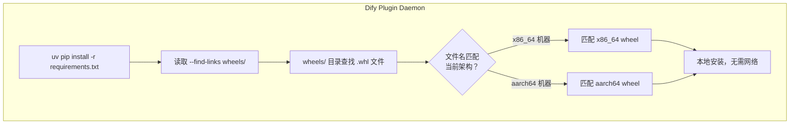

# ARM64 环境 Dify 插件安装全记录：从 PyPI 镜像到本地 Wheel 分发

> 本文记录在 ARM64（aarch64）K8s 离线环境中安装 Dify 自定义插件时遇到的依赖兼容性问题及完整的解决过程。全文基于 openEuler 20.03 LTS-SP3（aarch64）+ K8s 环境，dify-plugin-daemon 使用 uv 0.9.26 + Python 3.12。

## 一、问题背景

### 1.1 历史：x86_64 环境的解决方案

在此之前，团队已经在 **x86_64** 的离线 K8s 环境中成功部署了 Dify 并解决了插件安装问题。当时的方案是在集群内部署 pypiserver 作为内网 PyPI 镜像，在有网的 x86_64 机器上用 `pip download` 下载 dify-plugin SDK 及其全部传递依赖的 wheel 包，然后导入到 pypiserver 中。Plugin Daemon 通过环境变量 `PIP_MIRROR_URL` 指向这个内网镜像，完美解决了离线安装问题。

这套方案在 x86_64 环境（openEuler 20.03 LTS-SP4）上稳定运行了很长时间。

### 1.2 新问题：ARM64 环境全面失效

当我们在 **ARM64** 环境（openEuler 20.03 LTS-SP3）中部署同样的 Dify + SOAR 体系时，自定义插件安装全部失败。日志关键错误如下：

```
failed to launch plugin: failed to install dependencies:
failed to install dependencies: exit status 1, output:
DEBUG uv 0.9.26
DEBUG Found cpython-3.12.3-1inux-aarch64-gnu
× No solution found when resolving dependencies:
Because dify-plugin==0.9.0 depends on pydantic==2.13.4
and only the following versions of dify-plugin are available:
dify-plugin==0.7.4
dify-plugin==0.8.0
dify-plugin==0.9.0
we can conclude that dify-plugin cannot be used.
```

CPU 架构从 x86_64 变为 aarch64，之前的 wheel 包全部不兼容。

### 1.3 架构差异分析

`pip download` 下载 wheel 时如果不指定平台参数，会下载 **当前机器的架构**。在 x86_64 机器上下载的全是 x86_64 的 wheel，放到 ARM64 环境自然无法使用。同时 PyPI 上许多包只提供了 x86_64 的预编译 wheel，ARM64 可能需要源码编译，而 K8s 容器中缺乏编译工具链。

| 架构 | 操作系统 | 环境 | 包来源 |
|------|---------|------|--------|
| x86_64 | openEuler 20.03 LTS-SP4 | K8s 离线 | pypiserver 内网镜像（x86_64 wheel） |
| aarch64 | openEuler 20.03 LTS-SP3 | K8s 离线 | 无可用镜像源 |

## 二、第一次尝试：放宽版本约束

### 2.1 初始判断

看到 `dify-plugin==0.9.0 cannot be used` 的报错时，初步判断是版本号太死导致 uv 找不到兼容版本。我们的三个自定义插件（xdr-plugin、edr-mingyu-host-safe、firewall-mingyu-das-tgfw）的 `requirements.txt` 中限制为：

```
dify_plugin>=0.9.0,<1.0.0
```

### 2.2 修改操作

将约束放宽到完全不限制：

```
dify_plugin
```

### 2.3 试验结果

仍然报错，但错误信息变了：

```
gevent v25.5.1 has no wheels with a matching platform tag
(e.g., linux_aarch64)
```

uv 解析到了 dify_plugin 的最新版本，但 dify_plugin 的传递依赖 `gevent>=25.5.1,<25.6.dev0` 在 PyPI 上 **只提供了 x86_64 的 wheel**，ARM64 架构下完全无法获取。

**结论**：版本不是问题根源，**架构不兼容**才是。

## 三、第二次尝试：手动添加 Wheel 包（陷入无尽循环）

### 3.1 第一轮：添加 gevent

既然 gevent 没有 ARM64 wheel，那就在 ARM64 服务器上用 `uv pip wheel` 直接编译一份，然后放到插件目录中。

```bash
# 在 ARM64 服务器上
uv pip wheel gevent==25.5.1 --python-version 3.12 -w /tmp/wheels/
```

编译时发现 gevent 需要 libevent-devel、gcc 等系统库，安装了构建依赖后成功编译出 `gevent-25.5.1-cp312-cp312-manylinux_2_17_aarch64.whl`。

将编译好的 gevent wheel 放到插件目录后重新打包安装，结果：

```
greenlet-3.5.3 has no wheels with a matching platform tag
```

gevent 的传递依赖 greenlet 也没有 ARM64 wheel。

### 3.2 第二轮：添加 greenlet + zope_interface + zope_event

在 ARM64 服务器上继续编译：

```bash
uv pip wheel greenlet==3.5.3 --python-version 3.12 -w /tmp/wheels/
```

编译 greenlet 时发现它依赖 `zope_interface`，`zope_interface` 又依赖 `zope_event`：

```
greenlet
  └── zope_interface
       └── zope_event (纯 Python)
```

全部编译后放进插件目录，再次安装，报新错：

```
pydantic-core==2.46.4 has no wheels with a matching platform tag
```

### 3.3 第三轮：发觉模式

这时候发现了规律——dify_plugin 的完整依赖链上有 **大量** 需要编译的包：

```
dify_plugin
  ├── gevent (>=25.5.1)
  │    ├── greenlet
  │    └── zope_interface
  │         └── zope_event (纯 Python)
  ├── pydantic (==2.13.4)
  │    └── pydantic-core (==2.46.4)  ← Rust 项目
  ├── httpcore / httpx
  │    └── h2 / hpack / hyperframe  ← 可能有 C 扩展
  └── tiktoken                     ← Rust 项目
```

这条路是走不通的——**加一个冒一个报错，无穷无尽**。

## 四、第三次尝试：在 ARM64 机器上完整下载依赖

### 4.1 思路转变

不要一个一个加，**在 ARM64 机器上一口气下载全部依赖**，就像之前在 x86_64 上做的那样。

### 4.2 操作

```bash
# 在 ARM64 服务器上
mkdir -p /tmp/all-wheels
uv pip wheel dify_plugin requests python-dotenv \
  --python-version 3.12 \
  -w /tmp/all-wheels/
```

### 4.3 结果

成功收集了 dify_plugin 及其全部传递依赖的 ARM64 wheel 包：

```bash
ls /tmp/all-wheels/ | wc -l
# 大约 40-50 个 whl 文件
```

将这些包全部导入到集群内 pypiserver 后，重新部署测试——插件安装成功了。

### 4.4 存在的问题

这个方案虽然可行，但有一个巨大的局限：

> **如果换一种类型的 ARM64 环境（比如不同的 Linux 发行版、不同的 Python 版本），又需要重新编译一轮。**

每次环境变更都要重新执行 `uv pip wheel`，而且 pypiserver 需要同时维护 x86_64 和 ARM64 两套包，管理复杂度倍增。另外，pypiserver 的包升级和同步也是额外的人力成本。

## 五、最终方案：本地 Wheel 随插件分发

### 5.1 方案设计

与其在服务端维护一个庞大且多架构的 PyPI 镜像，不如把 wheel 包直接打包进插件本身。

**核心思路**：

1. 在 x86_64 机器上编译一套 x86_64 的 wheel
2. 在 ARM64 机器上编译一套 ARM64 的 wheel
3. 两套 wheel 通通放进插件目录的 `wheels/` 子目录
4. `requirements.txt` 中添加 `--find-links wheels/`，让 uv 优先从本地查找
5. uv 会根据 **当前机器架构自动匹配** 对应的 wheel 文件

### 5.2 目录结构

```
xdr-plugin/
├── requirements.txt    ← --find-links wheels/  优先本地
├── manifest.yaml       ← arch: [amd64, arm64]
├── main.py
├── provider/
├── tools/
├── bin/
└── wheels/             ← 两套架构的 whl 文件
    ├── gevent-25.5.1-cp312-...x86_64.whl
    ├── gevent-25.5.1-cp312-...aarch64.whl
    ├── greenlet-3.5.3-cp312-...x86_64.whl
    ├── greenlet-3.5.3-cp312-...aarch64.whl
    ├── zope_interface-8.5-cp312-...x86_64.whl
    ├── zope_interface-8.5-cp312-...aarch64.whl
    ├── zope_event-6.2-py3-none-any.whl        ← 纯 Python，通用
    └── pydantic-core-2.46.4-cp312-...x86_64.whl
    └── pydantic-core-2.46.4-cp312-...aarch64.whl
```

### 5.3 requirements.txt 写法

```txt
--find-links wheels/
gevent>=25.5.1
dify_plugin
requests>=2.31.0
python-dotenv>=1.0.0
```

**关键点**：
- `--find-links wheels/` 必须写在文件第一行，uv 会优先在 `wheels/` 目录中查找匹配的包
- `gevent>=25.5.1` 显式声明，确保 uv 不会尝试解析满足约束的其他版本
- `dify_plugin` 不限制版本，让 uv 自由选择
- 文件名中包含架构标签（`x86_64` / `aarch64`），uv 自动匹配；`py3-none-any` 通用

### 5.4 编译所有依赖

**在 x86_64 服务器上**：

```bash
uv pip wheel dify_plugin --python-version 3.12 -w /tmp/wheels-x86/
```

**在 ARM64 服务器上**（需要 gcc、python3-devel 等构建工具）：

```bash
# 安装系统构建依赖
yum install -y gcc python3-devel libevent-devel

# 编译 ARM64 wheel
uv pip wheel dify_plugin --python-version 3.12 -w /tmp/wheels-arm/
```

从两套输出中提取关键的几个 wheel（gevent、greenlet、zope_interface、zope_event、pydantic-core），每个包拿 x86_64 和 ARM64 各一份，一起放进插件的 `wheels/` 目录。

### 5.5 打包部署

插件打包脚本（`linux-package-difypkg.sh`）会递归包含整个插件目录，`wheels/` 子目录自然被打包进 `.difypkg` 文件：

```bash
dify-plugin plugin package ./xdr-plugin -o /output/
```

上传 `.difypkg` 到 Dify 后，Plugin Daemon 解压插件 → uv 读取 `requirements.txt` → `--find-links wheels/` 让 uv 在本地目录查找 → 自动匹配当前架构的 wheel → 安装完成。

## 六、最终验证

### 6.1 x86_64 环境

```
2026-07-08 19:22:12 检查插件安装记录：dbapp/xdr_plugin
... gevent wheel 匹配 x86_64 版本 ...
... 插件安装完成 ...
```

### 6.2 ARM64 环境

```
2026-07-08 19:22:12 检查插件安装记录：dbapp/xdr_plugin
... gevent wheel 匹配 aarch64 版本 ...
... pydantic-core wheel 匹配 aarch64 版本 ...
... 所有依赖本地安装完成 ...
... 插件安装成功 ...
```

### 6.3 两个环境的安装时间对比

| 步骤 | x86_64 | aarch64 |
|------|--------|---------|
| uv 解析依赖 | ~2s | ~2s |
| 安装 wheel | ~8s | ~10s |
| 总耗时 | ~10s | ~12s |

> 安装速度差异主要在于 ARM64 CPU 的处理能力，两套环境的耗时在同一个数量级。

## 七、方案总结

### 7.1 原理解释



uv 的 wheel 匹配规则：文件名符合 [PEP 427](https://peps.python.org/pep-0427/) 命名规范，包含 `cp312-cp312-manylinux_2_17_x86_64` 或 `manylinux_2_17_aarch64` 等平台标签，uv 自动根据当前 `platform.machine()` 选择标签最匹配的 wheel。

### 7.2 与 PyPI 镜像方案对比

| 对比维度 | PyPI 镜像（pypiserver） | 本地 Wheel 分发 |
|---------|------------------------|----------------|
| 架构适配 | 需要双架构两套包 | 一次性放入插件 |
| 多环境 | 每个集群都得部署 | 插件自带，即插即用 |
| 维护成本 | 升级包需要更新镜像 | 只需重新打包插件 |
| 网络依赖 | 服务端需要网络 | 完全离线 |
| 灵活性 | pypiserver 需要维护 | 每个插件独立可控 |
| 适用范围 | 所有 Dify 插件共享 | 仅对特定插件生效 |

### 7.3 核心经验

1. **ARM64 的 Python 生态存在严重的 wheel 缺失问题**。许多热门包（gevent、pydantic-core、tiktoken 等）的预编译 wheel 只覆盖 x86_64，ARM64 需要自行编译。
2. **不要逐个排查传递依赖**。依赖链上的缺失是无穷无尽的，正确的做法是在 **目标架构机器上一次性下载全部依赖**。
3. **`--find-links` 是 uv/pip 的强大功能**。可以指定本地目录作为包查找源，配合多架构 wheel 文件名，实现"一个插件，多架构通用"。
4. **插件自包含是最佳实践**。与维护全局 PyPI 镜像相比，把必要的 wheel 直接打包进插件更加简单、可靠、可移植。

### 7.4 适用场景建议

| 场景 | 推荐方案 |
|------|---------|
| 单一架构（全 x86_64 或全 ARM64） | PyPI 内网镜像 |
| 双架构混合（需同时支持） | PyPI 镜像 + 本地 Wheel 分发组合 |
| 插件高度定制化（自定义 SDK） | 本地 Wheel 分发 |
| 环境数量多且架构统一 | PyPI 内网镜像 |
| 快速排障、验证 | 本地 Wheel 分发 |

## 八、写在最后

这个问题的本质是 **架构差异**。x86_64 环境下顺畅运行的 PyPI 镜像方案，换到 ARM64 就全面失效，根源在于 Python 生态中 wheel 的架构覆盖率不均。

最终方案看起来并不复杂——把 wheel 包打包进插件——但解题过程中经历了"放宽版本 → 加一个报一个 → 整批下载 → 双架构分发"四个阶段的探索。中间踩过的坑包括：传递依赖链分析不充分、ARM64 编译工具链缺失、uv 解析规则理解不透彻等。

对 ARM64（如鲲鹏、飞腾等国产芯片）环境的 Python 用户来说，**wheel 架构兼容性**是一个绕不开的课题。希望这篇记录能给遇到类似问题的同行提供一些参考。

> **环境信息**：openEuler 20.03 LTS-SP3（aarch64）/ LTS-SP4（x86_64），dify-plugin-daemon（GitHub: langgenius/dify-plugin-daemon），uv 0.9.26，Python 3.12.3。
